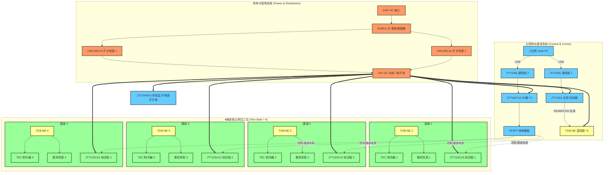

# 4通道光模块温控测试机台架构说明

根据测试机台的实物照片 [001.jpg](file:///C:/Users/zhong/git/Carbon/photo/001.jpg)、[002.jpg](file:///C:/Users/zhong/git/Carbon/photo/002.jpg) 以及型号清单 [003.txt](file:///C:/Users/zhong/git/Carbon/photo/003.txt)，该测试机台是一台**4通道光模块温控测试机台**。

---

## 1. 系统架构图

---

## 2. 系统模块功能说明

根据硬件配置，整个机台分为四大系统：

### 2.1 电源与配电系统
* **[NXBLE-32](file:///C:/Users/zhong/git/Carbon/photo/003.txt#L1)** (漏电断路器)：起整机交流电（AC）的过载、短路及漏电保护作用。
* **[LRS-600-24 * 2](file:///C:/Users/zhong/git/Carbon/photo/003.txt#L2)** (明纬 24V 开关电源)：提供整机直流（DC）供电，单路最大功率 600W，保障温控 TEC 满载制冷/加热时的电量需求。
* **接线端子排**：分流 24V DC 总线电源至各控制板卡和测试工位。

### 2.2 主控制与信号路切换
* **[JTT1005 * 2](file:///C:/Users/zhong/git/Carbon/photo/003.txt#L7)**：USB 接口转串口通信板，作为上位机 PC 与各个 JTT 模块之间的高速通信网关。
* **[JTT1051](file:///C:/Users/zhong/git/Carbon/photo/003.txt#L9)** & **[JTT1047V2 * 2](file:///C:/Users/zhong/git/Carbon/photo/003.txt#L8)**：主控制板和 I/O 拓展板，用于收集通道状态，并控制开关信号。
* **[HF3FF](file:///C:/Users/zhong/git/Carbon/photo/003.txt#L4)** (宏发继电器板)：用于切断或使能每个通道的供电、复位等硬控制线。
* **[JTT1049V3](file:///C:/Users/zhong/git/Carbon/photo/003.txt#L3)**：位于面板左上角，配有 LED 数码管和 4 个红色船型开关，用于各测试通道电源的手动切换与状态直观显示。

### 2.3 精准温控系统
* **[TCB-NE * 4](file:///C:/Users/zhong/git/Carbon/photo/003.txt#L5)** (TEC 温控驱动板)：
  * 针对 4 个测试通道进行独立温控。
  * 根据设定的温度（如常规测试的 $0\sim 70^\circ\text{C}$），通过双向 H 桥驱动 **TEC（半导体制冷片）** 实现快速加热或制冷。
  * 采集每个测试夹具内部的温度传感器反馈，进行闭环 PID 调节。

### 2.4 测试通道与夹具
* 机台顶部共有 4 个独立的测试工位，每个工位配备一块 **[JTT1031V3](file:///C:/Users/zhong/git/Carbon/photo/003.txt#L11)** 测试接口板（光模块插槽及外围电路）。
* 每个工位下方紧贴 TEC 制冷片、散热片及 **防反转散热风扇**（用于 TEC 热端散热）。
* 配有光纤软管将光信号引出至光功率计/误码仪等检测仪表。
