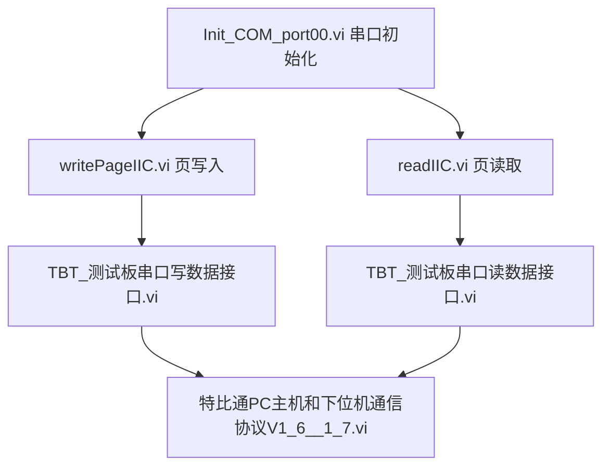

# 特比通 (TBT) I2C 读写 LabVIEW 程序逻辑梳理与伪代码

本文档梳理了 [writePageIIC.html](file:///C:/Users/zhong/git/Carbon/dist/TBT_IIC_READ_WRITE_VI/writePageIIC.html) 中所包含的 LabVIEW VI 的关系、串口通信配置、特比通主机协议封装以及完整的读写业务逻辑，并提供对应的清晰伪代码。

---

## 1. 模块层次关系与调用架构

通信系统的设计是分层的，主要由以下三个层次组成：



### 核心 VI 功能简介
1. **`Init_COM_port00.vi` (或 `端口初始化.vi`)**: 负责打开和配置底层的 VISA 串口会话。
2. **`writePageIIC.vi` (顶层写)**: 暴露给用户调用的 I2C 页写入接口，处理 256 字节长度转换逻辑。
3. **`readIIC.vi` (顶层读)**: 暴露给用户调用的 I2C 块读取接口，处理 256 字节长度转换逻辑。
4. **`TBT_测试板串口写数据接口.vi` (底层写包装)**: 根据端口类型（SFP/XFP/QSFP）做参数匹配，并调用通信协议 VI 写入数据。
5. **`TBT_测试板串口读数据接口.vi` (底层读包装)**: 同样根据端口类型匹配，调用通信协议 VI 获取数据，并解析出响应帧中的 Payload 实体。
6. **`特比通PC主机和下位机通信协议V1_6__1_7.vi` (协议核心)**: 负责请求帧的组包（帧头、长度、校验和）发送，延时等待，接收下位机响应帧并校验。

---

## 2. 特比通 (TBT) 串口帧协议规范

所有的读写指令都必须遵循特定的字节帧格式。

### 2.1 请求数据帧 (PC 主机 -> 下位机)

| 字节偏移 | 字段名称 | 字节长度 | 说明 |
| :--- | :--- | :--- | :--- |
| `0` | **帧头 (Header)** | 1 Byte | 固定为 `0xA5` |
| `1` | **槽位号 (Slot)** | 1 Byte | 槽位号 1-10。背板测试固定为 `16` (`0x10`)，单板默认为 `0` |
| `2` | **板卡类别 (Board Type)** | 1 Byte | 公共命令固定为 `0` |
| `3` | **帧总长度 (Length)** | 1 Byte | 头部(12字节) + 数据负载长度 (N) |
| `4` | **子命令索引 (Sub-cmd)** | 1 Byte | `0`: 读操作，`1`: 写操作 |
| `5` | **命令 ID (Command ID)** | 1 Byte | `2`: 读操作，`3`: 写操作 |
| `6` | **端口类型 (Port ID)** | 1 Byte | `1`: SFP, `2`: XFP, `3`: QSFP |
| `7` | **物理器件地址 (Slave Addr)** | 1 Byte | 例如 `0xA0`, `0xA2` 等 |
| `8` | **寄存器页 (Page)** | 1 Byte | 默认为 `0` |
| `9` | **读写大小 (Size)** | 1 Byte | `0` 代表 256 字节，其它代表实际字节大小 |
| `10` | **寄存器起始地址 (Start Addr)**| 1 Byte | 寄存器页内偏移地址 |
| `11..11+N-1` | **数据负载 (Payload)** | N Bytes | 仅写操作有效，长度为 N |
| `11+N` | **校验和 (Checksum)** | 1 Byte | 前面所有字节的累加和（低8位） |

### 2.2 响应数据帧 (下位机 -> PC 主机)

| 字节偏移 | 字段名称 | 字节长度 | 说明 |
| :--- | :--- | :--- | :--- |
| `0` | **帧头 (Header)** | 1 Byte | 固定为 `0x5A` |
| `1..2` | **槽位/板卡状态** | 2 Bytes | 下位机状态标识 |
| `3` | **帧总长度 (Length)** | 1 Byte | 响应帧总长度（12 + 读取的数据字节数） |
| `4..11` | **响应头信息** | 8 Bytes | 下位机应答头部参数 |
| `12..12+M-1` | **读取数据 (Data Payload)**| M Bytes | 仅读操作有效，长度为 M |
| `12+M` | **下位机状态码 (Status)** | 1 Byte | 倒数第二字节，`0x00` 表示成功，其它表示异常 |
| `12+M+1` | **校验和 (Checksum)** | 1 Byte | 最后一字节，前面所有响应字节的累加和（低8位） |

---

## 3. 详细伪代码实现

### 3.1 串口初始化: `Init_COM_port00.vi`

配置 VISA 串口参数以维持与下位机稳定连接。

```python
function Init_COM_port00(visa_resource_name):
    # 输入: visa_resource_name (例如 "COM3")
    # 输出: serial_session, error
    
    try:
        # 1. 初始化串口，配置波特率与帧格式 (115200 8N1)
        serial_session = open_serial_port(
            port=visa_resource_name,
            baudrate=115200,
            databits=8,
            parity=None,
            stopbits=1,
            flow_control=None
        )
        
        # 2. 禁用结束符，LabVIEW 逻辑中不使用终止符进行分包
        serial_session.set_attribute(Send_End_Enable=False)
        serial_session.set_attribute(TermChar_Enable=False)
        serial_session.set_attribute(ASRL_End_In=None)
        
        # 3. 清空缓冲区
        serial_session.clear_input_buffer()
        serial_session.clear_output_buffer()
        
        return serial_session, None
    except SerialException as err:
        return None, err
```

### 3.2 协议层组包与收发: `特比通PC主机和下位机通信协议V1_6__1_7.vi`

该模块是整个通信的核心，负责拼接字节数组、发送、加锁等待与校验。

```python
function send_and_receive_tbt_frame(serial_session, cmd_type, port_id, slave_addr, page, size_param, start_addr, payload_data=None, slot=0, board_type=0):
    # 输入:
    #   serial_session: 串口会话
    #   cmd_type: "读SFP/XFP/QSFP命令" 或 "写SFP/XFP/QSFP命令"
    #   port_id: 1(SFP), 2(XFP), 3(QSFP)
    #   size_param: 大小 (0代表256)
    #   payload_data: 待写入数据字节数组 (读操作时为 None)
    
    # 1. 区分读写子命令与命令 ID
    if cmd_type == "写SFP/XFP/QSFP命令":
        sub_cmd = 1
        cmd_id = 3
        actual_payload = payload_data if payload_data else []
    else: # "读SFP/XFP/QSFP命令"
        sub_cmd = 0
        cmd_id = 2
        actual_payload = []
        
    payload_len = len(actual_payload)
    total_len = 12 + payload_len
    
    # 2. 组装请求帧前 11 字节
    req_frame = [
        0xA5,        # 帧头
        slot,        # 槽位
        board_type,  # 板卡类型
        total_len,   # 帧总长
        sub_cmd,     # 子命令
        cmd_id,      # 命令 ID
        port_id,     # 端口类型
        slave_addr,  # 器件地址
        page,        # 寄存器页
        size_param,  # 大小 (0或实际大小)
        start_addr   # 起始地址
    ]
    
    # 3. 追加数据负载 (仅写)
    req_frame.extend(actual_payload)
    
    # 4. 计算累加和校验码并追加
    checksum = sum(req_frame) & 0xFF
    req_frame.append(checksum)
    
    # 5. 发送数据
    serial_session.write(bytes(req_frame))
    serial_session.flush()
    
    # 6. 等待下位机处理
    # 读命令延迟 0.06~0.08 秒，写命令延迟较长 (例如 0.1~0.15 秒)
    delay_time = 0.06 if sub_cmd == 0 else 0.1
    sleep(delay_time)
    
    # 7. 读取下位机应答
    # 7.1 读取前 4 字节应答头以解析出响应帧的真实总长度
    resp_header = serial_session.read(4)
    if len(resp_header) < 4:
        raise TimeoutError("读取响应帧头超时")
        
    if resp_header[0] != 0x5A:
        raise ValueError("无效的应答帧头，预期为 0x5A")
        
    resp_len = resp_header[3] # 第4字节代表响应总长度
    
    # 7.2 根据总长度读取剩余的响应数据
    resp_body = serial_session.read(resp_len - 4)
    if len(resp_body) < (resp_len - 4):
        raise TimeoutError("读取响应体超时")
        
    full_response = resp_header + resp_body
    
    # 8. 校验应答帧校验和
    recv_checksum = full_response[-1]
    calc_checksum = sum(full_response[:-1]) & 0xFF
    if recv_checksum != calc_checksum:
        raise ValueError("应答数据帧校验和错误")
        
    # 9. 检查状态码 (倒数第二字节)
    status_code = full_response[-2]
    if status_code != 0x00:
        raise RuntimeError(f"下位机操作失败，状态码: 0x{status_code:02X}")
        
    # 10. 返回完整的数据包
    return full_response, True
```

### 3.3 底层接口封装

#### 3.3.1 写数据接口: `TBT_测试板串口写数据接口.vi`

包装顶层参数为协议帧，发起写操作。

```python
function TBT_Write_Serial_Interface(serial_session, port_name, slave_addr, start_addr, size_param, wrt_data, page=0, slot=0, board_type=0, is_write_enabled=True):
    # 输入: port_name ("SFP"/"XFP"/"QSFP")
    
    if not is_write_enabled:
        return False, "Write Disabled"
        
    # 1. 端口映射转换
    port_id = 1
    if port_name == "XFP":
        port_id = 2
    elif port_name == "QSFP":
        port_id = 3
        
    try:
        # 2. 调用通信协议 VI，子命令设为 "写SFP/XFP/QSFP命令"
        response, success = send_and_receive_tbt_frame(
            serial_session=serial_session,
            cmd_type="写SFP/XFP/QSFP命令",
            port_id=port_id,
            slave_addr=slave_addr,
            page=page,
            size_param=size_param,
            start_addr=start_addr,
            payload_data=wrt_data,
            slot=slot,
            board_type=board_type
        )
        return success, "OK"
    except Exception as err:
        return False, str(err)
```

#### 3.3.2 读数据接口: `TBT_测试板串口读数据接口.vi`

发起读操作，并从应答字节流中切片提取出 Payload 内容。

```python
function TBT_Read_Serial_Interface(serial_session, port_name, slave_addr, start_addr, size_param, page=0, slot=0, board_type=0, is_read_enabled=True):
    
    if not is_read_enabled:
        return None, False, "Read Disabled"
        
    port_id = 1
    if port_name == "XFP":
        port_id = 2
    elif port_name == "QSFP":
        port_id = 3
        
    try:
        # 1. 调用通信协议 VI，子命令设为 "读SFP/XFP/QSFP命令"
        response, success = send_and_receive_tbt_frame(
            serial_session=serial_session,
            cmd_type="读SFP/XFP/QSFP命令",
            port_id=port_id,
            slave_addr=slave_addr,
            page=page,
            size_param=size_param,
            start_addr=start_addr,
            payload_data=None,
            slot=slot,
            board_type=board_type
        )
        
        if success:
            # 2. 如果成功，从响应的第 12 字节开始提取数据
            # 确定待读取的字节长度
            read_len = 256 if size_param == 0 else size_param
            
            # 数据切片 [12 : 12 + read_len]
            extracted_data = response[12 : 12 + read_len]
            return extracted_data, True, "OK"
        else:
            return None, False, "Failed"
    except Exception as err:
        return None, False, str(err)
```

---

### 3.4 顶层业务封装

#### 3.4.1 页写入业务: `writePageIIC.vi`

```python
function writePageIIC(serial_session, port_name, slave_addr, start_addr, bytes_to_write, wrt_data, is_enabled=True, error_in=None):
    # 如果 error_in 存在错误，直接透传错误退出
    if error_in and error_in.has_error:
        return error_in
        
    if not is_enabled:
        return "Not Enabled"
        
    # 1. 特殊字节大小转换：如果待写入长度为 256 字节，则对应协议大小 size_param 传入 0
    size_param = 0 if bytes_to_write == 256 else bytes_to_write
    
    # 2. 调用底层写接口
    success, message = TBT_Write_Serial_Interface(
        serial_session=serial_session,
        port_name=port_name,
        slave_addr=slave_addr,
        start_addr=start_addr,
        size_param=size_param,
        wrt_data=wrt_data
    )
    
    if not success:
        return Create_Error_Cluster(status=True, code=-1, source=f"writePageIIC -> {message}")
        
    return Create_Error_Cluster(status=False, code=0, source="")
```

#### 3.4.2 块读取业务: `readIIC.vi`

```python
function readIIC(serial_session, port_name, slave_addr, start_addr, bytes_to_read, is_enabled=True, error_in=None):
    # 如果 error_in 存在错误，直接透传错误退出
    if error_in and error_in.has_error:
        return None, "", error_in
        
    if not is_enabled:
        return None, "", "Not Enabled"
        
    # 1. 特殊字节大小转换：如果需要读取 256 字节，则对应协议大小 size_param 传入 0
    size_param = 0 if bytes_to_read == 256 else bytes_to_read
    
    # 2. 调用底层读接口
    data_array, success, message = TBT_Read_Serial_Interface(
        serial_session=serial_session,
        port_name=port_name,
        slave_addr=slave_addr,
        start_addr=start_addr,
        size_param=size_param
    )
    
    if not success:
        err_out = Create_Error_Cluster(status=True, code=-1, source=f"readIIC -> {message}")
        return None, "", err_out
        
    # 3. 将字节数据转换为 String 格式供系统上层使用
    data_string = byte_array_to_string(data_array)
    err_out = Create_Error_Cluster(status=False, code=0, source="")
    
    return data_array, data_string, err_out
```

---

## 4. 关键业务流程图

### 4.1 写入流程 (Write Flow)
```
[开始 writePageIIC]
       │
       ▼
 [bytes_to_write == 256?] ──(Yes)──> [size_param = 0]
       │
      (No)
       │
       ▼
 [size_param = bytes_to_write]
       │
       ▼
 [打包请求数据帧] (A5 + slot + type + len + 1 + 3 + port_id + slave_addr + page + size_param + start_addr + Payload + Checksum)
       │
       ▼
 [通过串口 VISA Write 发送]
       │
       ▼
 [等待 0.1s]
       │
       ▼
 [读取应答数据帧]
       │
       ▼
 [校验响应 Checksum / 状态码] ──(异常)──> [输出 Error Out]
       │
     (正常)
       │
       ▼
[操作结果 = True / 结束]
```

### 4.2 读取流程 (Read Flow)
```
[开始 readIIC]
       │
       ▼
 [bytes_to_read == 256?] ──(Yes)──> [size_param = 0]
       │
      (No)
       │
       ▼
 [size_param = bytes_to_read]
       │
       ▼
 [打包请求数据帧] (A5 + slot + type + len + 0 + 2 + port_id + slave_addr + page + size_param + start_addr + Checksum)
       │
       ▼
 [通过串口 VISA Write 发送]
       │
       ▼
 [等待 0.06s]
       │
       ▼
 [读取 4 字节响应头] ──> [解析出总长度 resp_len] ──> [读取剩余 resp_len-4 字节]
       │
       ▼
 [校验响应 Checksum / 状态码] ──(异常)──> [输出 Error Out]
       │
     (正常)
       │
       ▼
 [响应数组中切片提取数据] (从偏移 12 开始，长度为 size_param / 256)
       │
       ▼
 [转换为 String 并输出 RD_DATA 和 RD_STR] ──> [结束]
```
